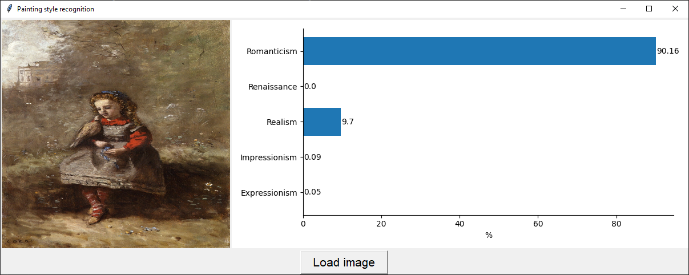
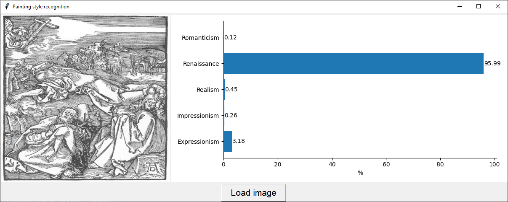
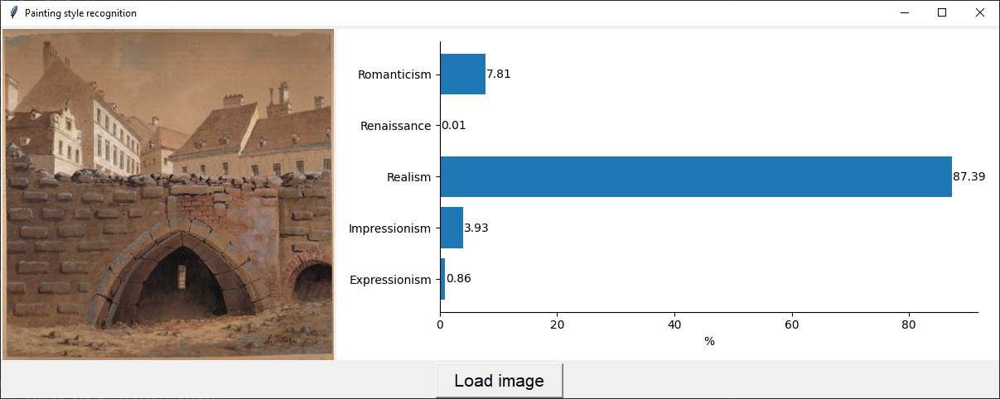
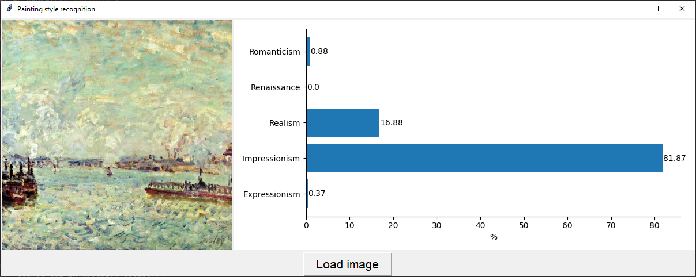
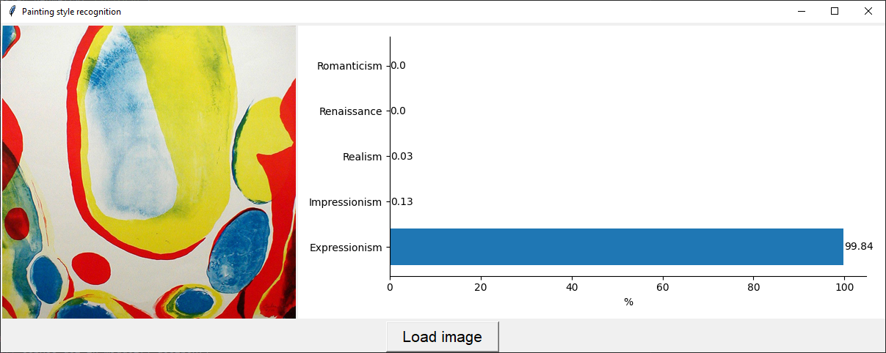

# Art style recognition
Application for classifying images based on art style:
* Romanticism
* Renaissance
* Realism
* Impressionism
* Expressionism

## Before running
Please install requirements using pip:
```
pip install -r requirements.txt
```
or conda:
```
conda install --file requirements.txt
```

## How to run
Just make sure the model is the same directory and run command
```
python main.py
```

## Model
We used [MobileNet](https://www.tensorflow.org/api_docs/python/tf/keras/applications/MobileNet) pre-trained on [ImageNet](https://www.image-net.org/index.php) dataset consisting of 1.4M images and 1000 classes.

## Data source used for training
https://github.com/cs-chan/ArtGAN/tree/master/WikiArt%20Dataset

## Examples
Romanticism:

Renaissance:

Realism:

Impressionism:

Expressionism:


## Training process
If you want to train network by yourself make sure put your dataset like this
```
/
|
|
---- /input
|    |
|    |
|    ---- /wikiart
|    |
|    |
|    |    ---- /Romanticism
|    |    |    akseli-gallen-kallela_rustic-life-1887.jpg
|    |    |    alexander-ivanov_via-appia-at-sunset-1845.jpg
|    |    |    ...
|    |
|    |
|    |    ---- /Renaissance
|    |         agnolo-bronzino_altarpiece.jpg
|    |         albrecht-altdorfer_mary-in-glory-1526.jpg
|    |         ...
|    |
|    |    ...
|
|
```
Then pick your model (or use MobileNet which is already in code) and run
```
python train.py
```